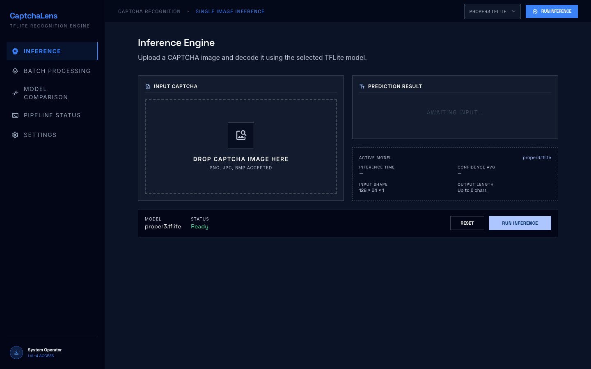
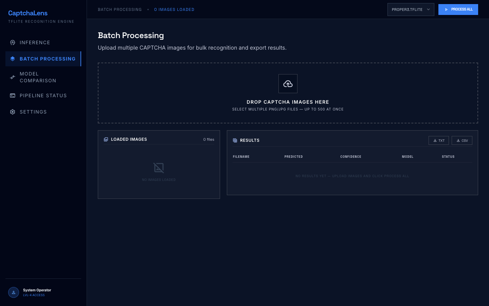
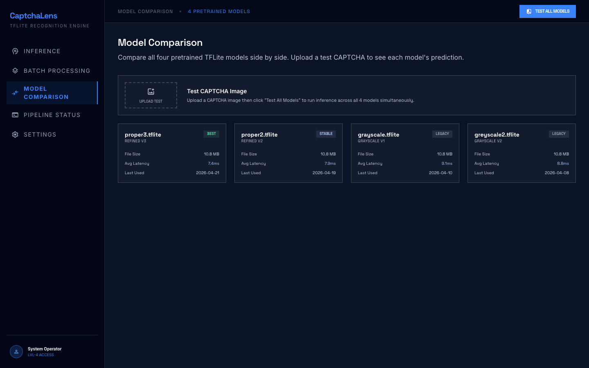
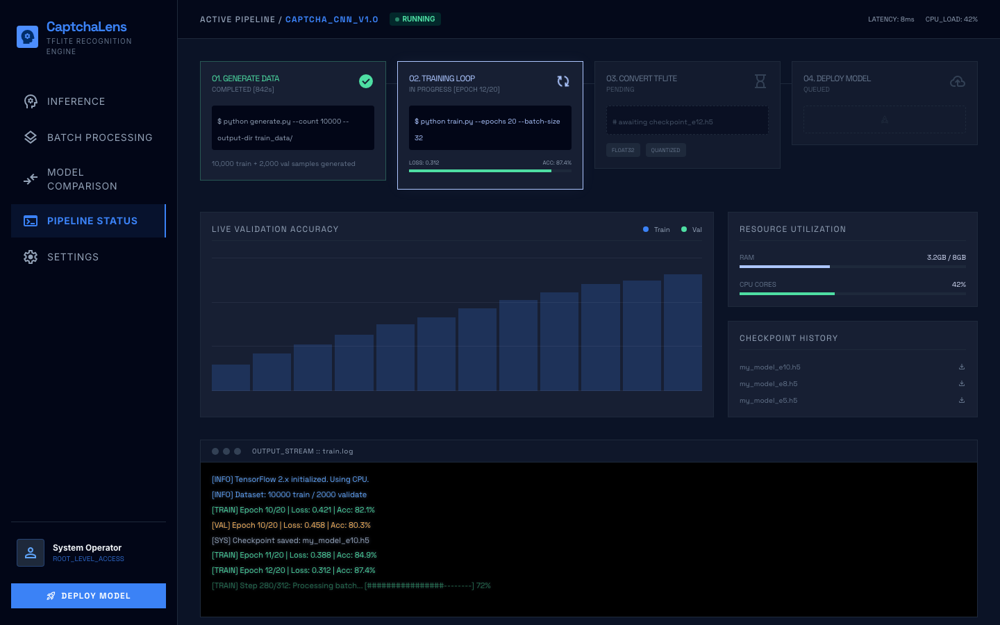
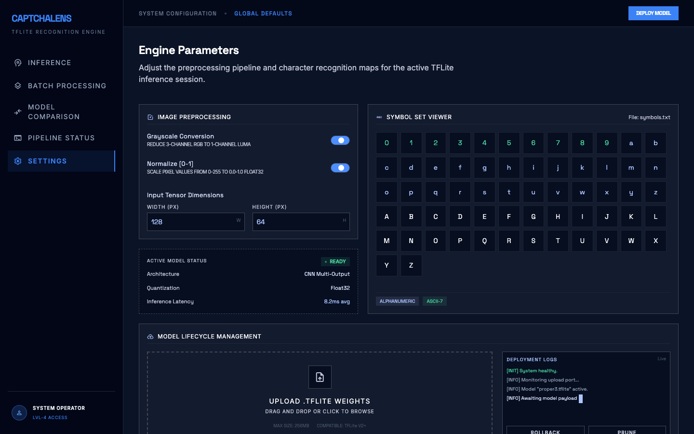

# CAPTCHA Recognition with TensorFlow Lite

This project trains a CNN to recognize text from CAPTCHA images and exports it as a TensorFlow Lite model for fast, lightweight inference on CPU, mobile, or embedded devices.

## Web UI — CaptchaLens

A dark-mode browser dashboard is included in `ui/` for interacting with the models visually. Open any `.html` file directly — no server required.

### Inference



Upload a single CAPTCHA image, select a model, and see character-by-character predictions with per-character confidence bars.

### Batch Processing



Upload multiple CAPTCHAs at once. Results display in a live table with confidence ratings and can be exported as `.txt` or `.csv`.

### Model Comparison



Run all four pretrained models on the same CAPTCHA simultaneously and see a ranked side-by-side summary with the best model highlighted.

### Pipeline Status



4-step training pipeline tracker (Generate → Train → Convert → Deploy) with a live accuracy chart, resource utilization bars, checkpoint history, and a live log stream.

### Settings



Toggle grayscale conversion and normalization, set input tensor dimensions, browse the full symbol set, and upload new `.tflite` model weights.

---

## Project Structure

| File | Description |
|------|-------------|
| `generate.py` | Generates synthetic CAPTCHA images for training/validation datasets |
| `train.py` | Trains a CNN model on generated CAPTCHA images (supports GPU and CPU) |
| `convert.py` | Converts a trained Keras `.h5` model to TensorFlow Lite `.tflite` format |
| `classify.py` | Classifies CAPTCHAs using a full Keras model (`.json` + `.h5`) |
| `classify_lite.py` | Classifies CAPTCHAs using a TFLite model (faster, no full TF required) |
| `get_data.py` | Downloads CAPTCHA images from a remote server |
| `symbols.txt` | Character set used for CAPTCHA generation and recognition |
| `*.tflite` | Pretrained TFLite models ready for inference |
| `ui/` | CaptchaLens web dashboard (5 HTML pages, no server needed) |

## Install Dependencies

```bash
pip install -r requirements.txt
```

## Usage

### 1. Generate training data

```bash
python generate.py \
  --width 128 --height 64 \
  --upper-length 6 --lower-length 4 \
  --count 10000 \
  --output-dir train_data/ \
  --symbols symbols.txt \
  --dict-name train_dict.txt
```

### 2. Train the model

```bash
python train.py \
  --width 128 --height 64 --length 6 \
  --batch-size 32 --epochs 20 \
  --train-dataset train_data/ \
  --validate-dataset validate_data/ \
  --output-model-name my_model \
  --symbols symbols.txt \
  --train-dict train_dict.txt \
  --validate-dict validate_dict.txt
```

> Automatically uses GPU if available, falls back to CPU otherwise.

### 3. Convert to TFLite

```bash
python convert.py --model-name my_model --output my_model_lite
```

### 4. Classify CAPTCHAs with TFLite model

```bash
python classify_lite.py \
  --model-name my_model_lite \
  --captcha-dir captchas/ \
  --output results.txt \
  --symbols symbols.txt \
  --shortname myname
```

### 5. Classify CAPTCHAs with full Keras model

```bash
python classify.py \
  --model-name my_model \
  --captcha-dir captchas/ \
  --output results.txt \
  --symbols symbols.txt
```

## Pretrained Models

Four `.tflite` models are included for immediate use:

- `grayscale.tflite` / `greyscale2.tflite` — trained on grayscale-preprocessed CAPTCHAs
- `proper2.tflite` / `proper3.tflite` — refined versions with improved accuracy

## Bug Fixes

The following bugs were identified and fixed:

| File | Bug | Fix |
|------|-----|-----|
| `train.py` | `--validate-dict` arg check was missing; `args.symbols` was checked twice | Added correct `args.validate_dict is None` guard |
| `train.py` | Validation data loaded `train_dict` instead of `validate_dict` | Changed `open(args.train_dict)` → `open(args.validate_dict)` |
| `train.py` | Hard crash if no GPU found (`assert` on physical devices) | Graceful CPU fallback with informational print |
| `classify.py` | Image read as RGB instead of grayscale — mismatched model input | Switched to grayscale + Otsu threshold, matching `train.py` |
| `classify.py` | Shape unpacked as `(c, h, w)` — OpenCV returns `(H, W, C)` | Fixed to `(h, w) = image.shape` with `reshape([-1, h, w, 1])` |
| `classify.py` | Padding character appended as `' '` instead of `'&'` | Changed to `'&'` to match `train.py` and `classify_lite.py` |
| `classify.py` | Unused `string` and `random` imports | Removed |
| `generate.py` | Missing `--dict-name` argument validation | Added `args.dict_name is None` guard |
| `get_data.py` | `main()` never called — script was a no-op | Added `if __name__ == '__main__': main()` |
| `get_data.py` | Missing `--shortname` validation | Added `args.shortname is None` guard |
| `get_data.py` | `captchas/` directory not created before writing files | Added `os.makedirs('captchas', exist_ok=True)` |

## Author

Atharva Devne
